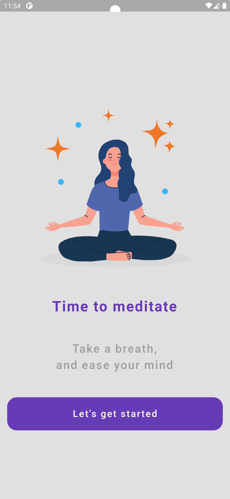
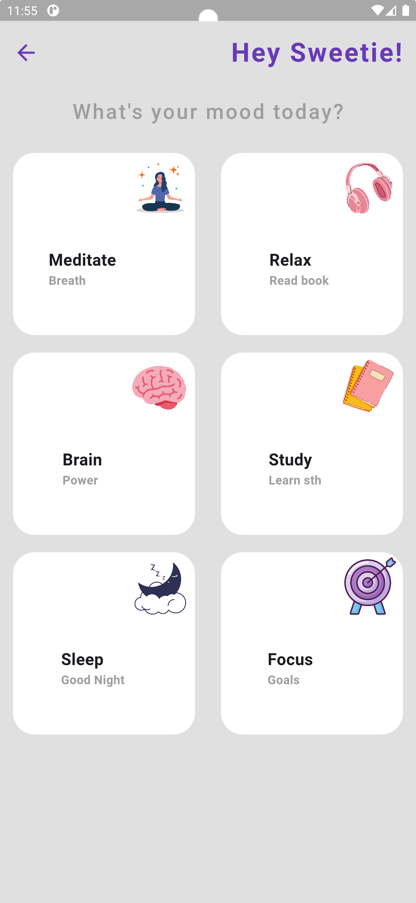
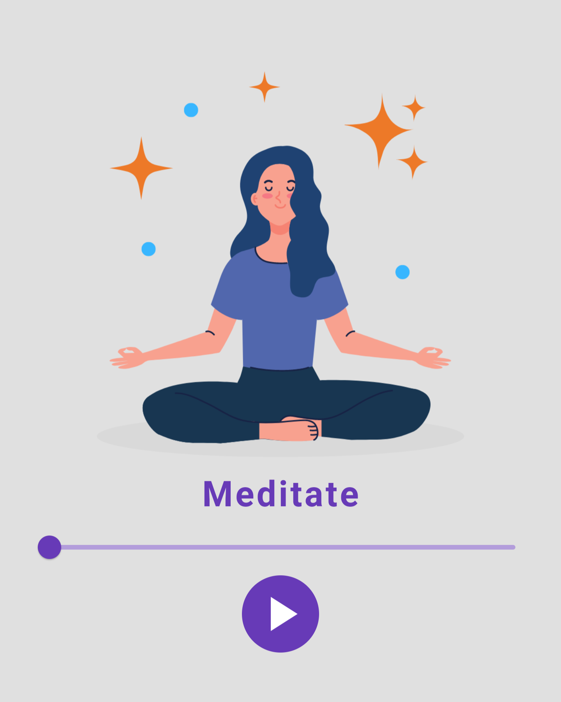
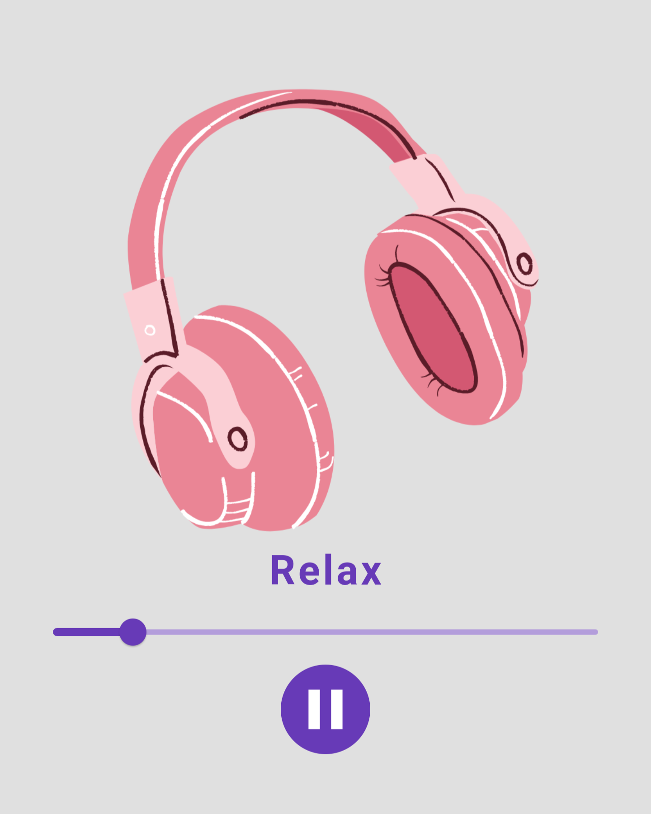
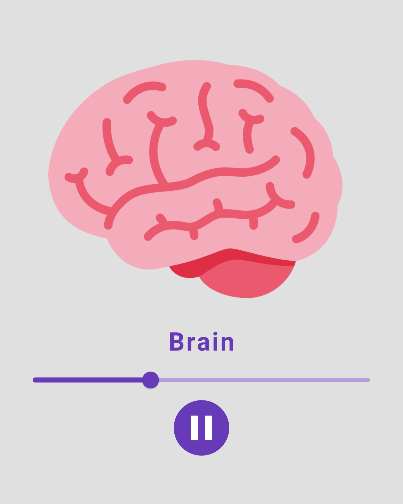
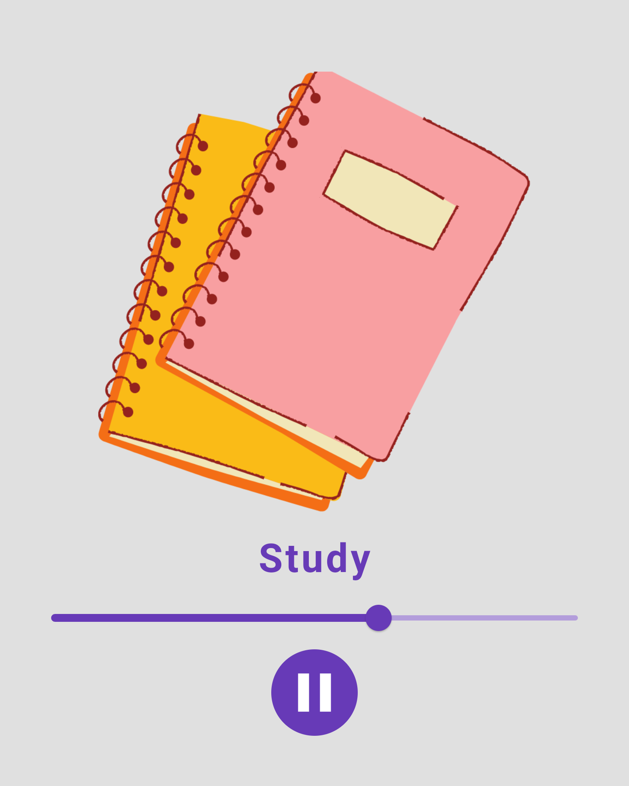
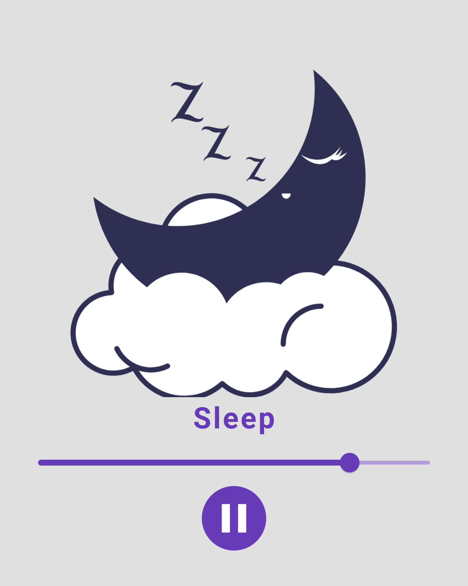
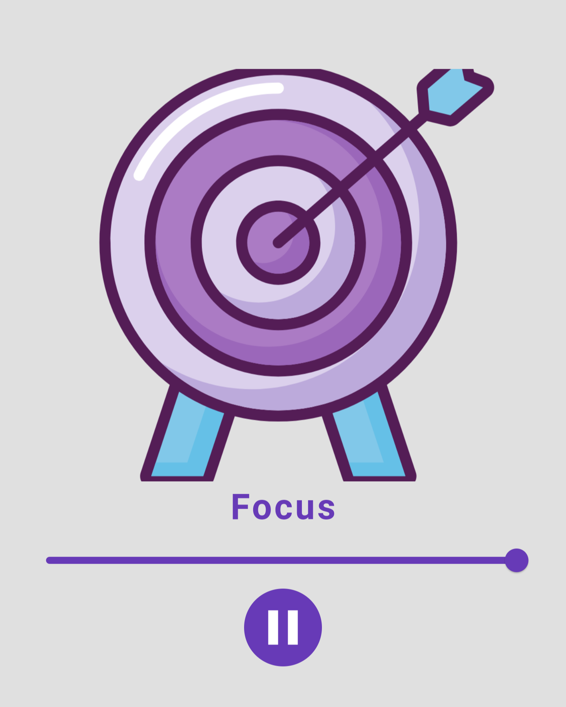

# Meditation Timer

## Project Overview

The **Meditation Timer** app is designed to guide users through a calming and focused meditation experience, tailored to their specific needs. With a simple yet elegant interface, users can choose different meditation modes based on their mood, such as relaxing, focusing, or energizing sessions. The app offers a variety of customizable options to help users find their inner peace and achieve a state of mindfulness.

## Features

- **Customizable Meditation Sessions**: Tailor your meditation experience by selecting different moods and session lengths.
- **Interactive UI**: Engage with a user-friendly interface that makes the meditation process intuitive and enjoyable.
- **Mood-Based Guidance**: Choose from a variety of meditation modes designed to match your current mood or goal, whether it's relaxation, focus, or sleep.
- **Progress Tracking**: Easily control and monitor your meditation session with straightforward controls and a progress slider.

## Usage

1. **Open the App:** Start the Meditation Timer to access the main screen.
2. **Select Your Mood:** Choose a mood that aligns with your current state or goal, such as meditation, relaxation, brain power, study, sleep, or focus.
3. **Customize Your Session:** Set your preferred session duration.
4. **Start Your Session:** Tap 'Play' to begin. The app will guide you with music and visual cues.
5. **Control Your Session:** Use the pause, resume, or stop buttons to manage your session as needed.
6. **Complete Your Session:** Once the session ends, the app will notify you, leaving you feeling refreshed and centered.

## Screenshots

- **Welcome Screen:**
  

- **Mood Selection:**
  

- **Sessions:**

  | Meditate Session                                   | Relax Session                                      | Brain Power Session                                |
  | -------------------------------------------------- | -------------------------------------------------- | -------------------------------------------------- |
  |  |  |  |

  | Study Session                                      | Sleep Session                                      | Focus Session                                      |
  | -------------------------------------------------- | -------------------------------------------------- | -------------------------------------------------- |
  |  |  |  |

  
